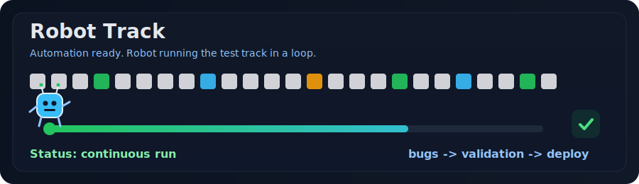

Profissional de Qualidade de Software (QA) focado em estabilidade, confiabilidade e excelência de aplicações por meio de testes manuais e automatizados.

<a href="https://alex12rodrigues.infinityfree.me/?i=1">Portfólio</a> •
<a href="https://www.linkedin.com/in/alex-rodrigues-de-oliveira-a9754b17b/">LinkedIn</a>

---

## Skills

**Ferramentas e práticas de QA**

- Cypress
- Playwright
- Testes de API
- Análise e reporte de bugs
- Validação de fluxos E2E

## QA em ação

## Robô QA em ação

---
